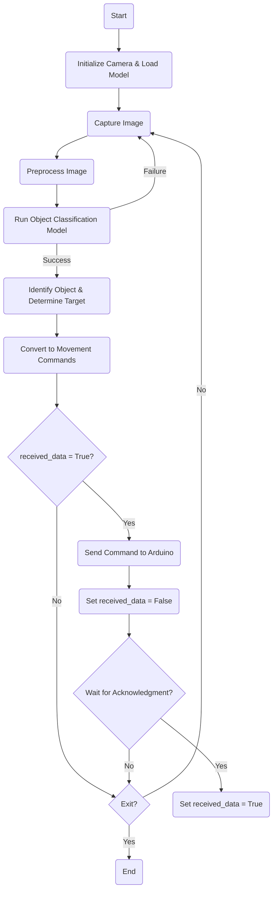
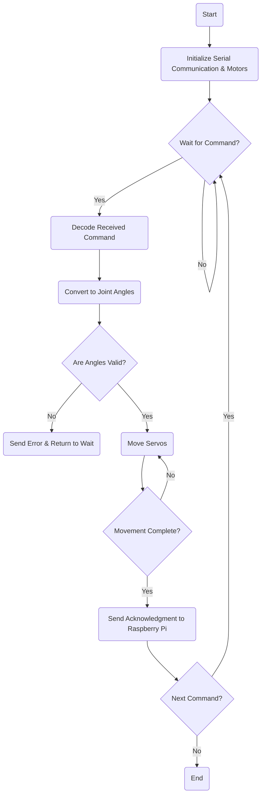

# Robotic-arm-classifies-objects-using-computer-vision-with-raspi4-and-arduino

## Description

This project involves a robotic arm capable of classifying objects using computer vision and sorting them accordingly. A Raspberry Pi 4 processes images captured from a camera, runs a trained machine learning model, and communicates with an Arduino to control the robotic arm’s movements.

  

  

  

## System Overview

1. Computer Vision Subsystem: Identifies and classifies objects

  
2. Robotic Control Subsystem: Moves the robotic arm based on classifications.

## Hardware Components

- Raspberry Pi 4: Runs object classification and sends movement commands.
- Arduino: Controls the robotic arm servos.
- Camera Module: Captures images for object recognition.
- Robotic Arm with Servo Motors: Moves objects based on classification.
- Power Supply: Provides power to components.

## Software Architecture

1. Object Detection & Classification: OpenCV and a trained model classify objects.
2. Communication Protocol: Serial communication between Raspberry Pi and Arduino.
3. Motor Control: Arduino processes received commands and moves servos.

## Model Training Process

1. Data Collection: Capture images of objects using the camera module.
2. Preprocessing: Resize, normalize, and augment images.
3. Model Selection: Use a convolutional neural network (CNN) for classification.
4. Training: Train the model using TensorFlow/Keras.
5. Deployment: Convert the trained model to a format suitable for Raspberry Pi.

## Robotic Arm Kinematics

## Operation

1. System Initialization: Start Raspberry Pi and Arduino.
2. Object Detection: Capture image and classify the object.
3. Robotic Arm Movement: Calculate and execute joint angles for object handling.
